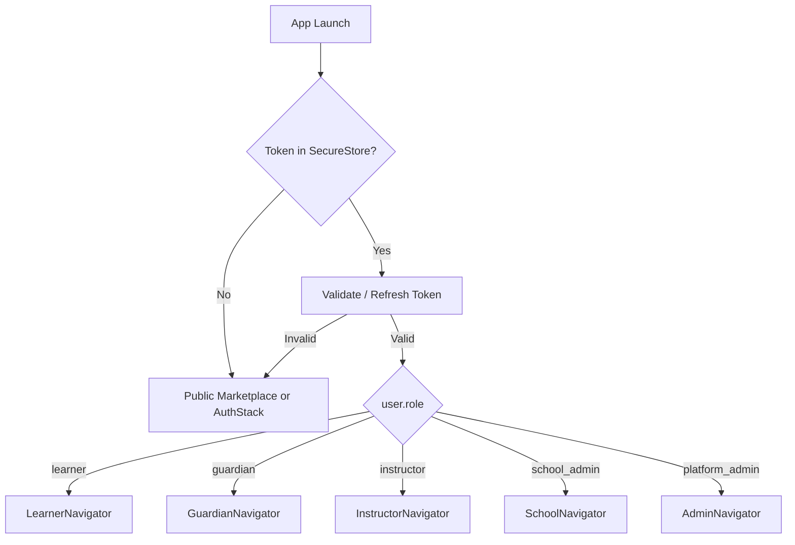
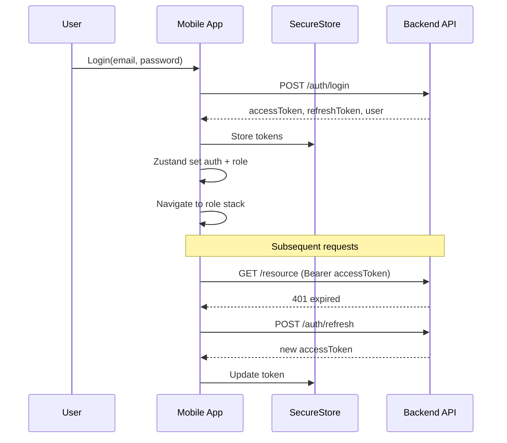
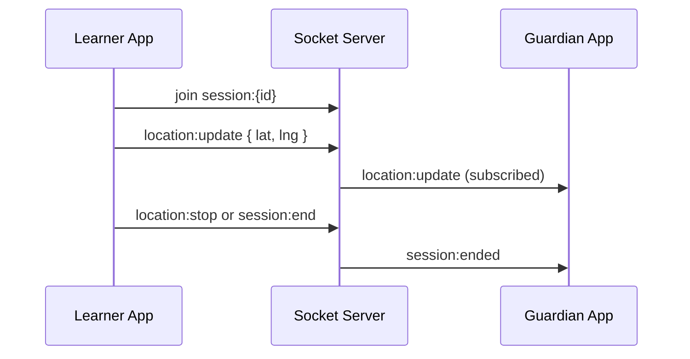

# Learn2Drive Mobile — Architecture

Initial architecture documentation for the Learn2Drive React Native application.

---

## 1. System Context

```
┌─────────────────────────────────────────────────────────────┐
│                    Learn2Drive Mobile App                    │
│  (Expo / React Native — Learner, Guardian, Instructor,      │
│   School Admin, Platform Admin)                             │
└───────────────┬─────────────────────────┬───────────────────┘
                │ HTTPS (REST)            │ WebSocket
                ▼                         ▼
┌───────────────────────────┐   ┌─────────────────────────┐
│   Learn2Drive API         │   │   Socket.IO Server       │
│   (JWT, RBAC)             │   │   (sessions, location)   │
└───────────────────────────┘   └─────────────────────────┘
                │
                ▼
┌───────────────────────────┐
│   PostgreSQL / Redis /     │
│   Payment (Paystack)       │
└───────────────────────────┘
```

The mobile client is a **presentation and realtime consumer**. Authorization is enforced server-side; the app implements UX-level RBAC.

---

## 2. Application Layers

```
┌────────────────────────────────────────────┐
│  Routes (src/app/)                          │  ← Expo Router pages & layouts
├────────────────────────────────────────────┤
│  Components (src/components/)             │  ← Reusable UI
├────────────────────────────────────────────┤
│  Hooks (src/hooks/)                         │  ← Business logic hooks
├────────────────────────────────────────────┤
│  API (src/api/)                             │  ← TanStack Query
├────────────────────────────────────────────┤
│  Store (src/store/)                         │  ← Zustand client state
├────────────────────────────────────────────┤
│  Services (src/services/)                 │  ← Socket, location, push
└────────────────────────────────────────────┘
```

**Dependency rule:** Routes import from components/hooks/api. API layer must not import from routes.

Feature screens shared by multiple route groups may live under
`src/features/{domain}/screens`. Expo Router files remain thin entry points.

---

## 3. App Bootstrap

`src/app/_layout.tsx` responsibilities:

1. Load fonts / hide splash screen
2. Wrap app with providers (`SafeAreaProvider`, `QueryClientProvider` when added)
3. Render root `<Stack />` for Expo Router
4. Public marketplace access and role-based redirects for protected areas

```typescript
// Current root layout
export default function RootLayout() {
  return (
    <SafeAreaProvider>
      <StatusBar />
      <Stack screenOptions={{ headerShown: false }} />
    </SafeAreaProvider>
  );
}
```

---

## 4. Navigation Architecture

### 4.1 Root Flow



### 4.2 Learner Stack (example)

```
LearnerNavigator (Bottom Tabs)
├── DiscoverTab → Stack
│   ├── SchoolList
│   ├── SchoolSearch
│   └── SchoolDetail
├── BookingsTab → Stack
│   ├── BookingList
│   ├── PackageSelect
│   └── BookingDetail
├── ProgressTab → Stack
│   ├── ProgressOverview
│   └── SessionHistory
└── ProfileTab → Stack
    └── Profile / Settings
```

Other roles follow the same pattern: tabs for primary areas, stacks for drill-down.

### 4.3 Public marketplace

```
PublicStack
├── LocationConsent
├── SchoolList
├── SchoolDetail
└── PackageBrowse
```

The public marketplace exposes non-sensitive school catalogue information
without requiring an account. Location consent is requested after its value is
explained and before nearby results are personalized. A manual/default area
remains available when permission is declined.

Protected actions cross an explicit authentication boundary:

```
Public PackageBrowse
  → Login / Registration
  → Protected root Checkout
  → Learner Booking
```

`(app)/checkout` is a sibling of `(app)/student`, keeping payment screens
outside the learner bottom-tab navigator.

### 4.4 Auth Stack

| Screen | Route name |
|--------|------------|
| Splash | `Splash` |
| Login | `Login` |
| Register | `Register` |
| Forgot Password | `ForgotPassword` |

---

## 5. Authentication Flow



---

## 6. Data Flow — Server State (TanStack Query)

```
Screen → useSchools() → queryFn → api/schools.getNearby()
                              ↓
                         Query Cache
                              ↓
                    UI renders data / loading / error
```

**Query key convention:**

```typescript
['schools', 'nearby', { lat, lng, radius }]
['bookings', 'list', { status, page }]
['sessions', 'detail', sessionId]
```

**Invalidation examples:**
- After booking created → invalidate `['bookings']`
- After session ended → invalidate `['sessions', sessionId]` and `['bookings']`

---

## 7. Data Flow — Client State (Zustand)

| Store | State | Consumers |
|-------|-------|-----------|
| `useAuthStore` | tokens, isAuthenticated, userId, role | RootNavigator, API client |
| `useSelectionStore` | selectedSchool, selectedPackage | Booking flow |
| `useSessionStore` | activeSession, coordinates | Instructor tracking, maps |
| `useUIStore` | modals, bottom sheets | Global UI |
| `useSettingsStore` | theme, notifications prefs | Settings screens |

---

## 8. Realtime Architecture



**Client modules:**
- `src/services/socket.ts` — connect, disconnect, emit, subscribe
- `src/features/tracking/hooks/useSessionTracking.ts`
- `src/services/location.ts` — expo-location updates while an active learner
  lesson is sharing

---

## 9. Maps Integration

`src/components/maps/AppMap.tsx` wraps `react-native-maps`:

| Use case | Markers | Polylines |
|----------|---------|-----------|
| School discovery | School pins | — |
| Active lesson (instructor) | Vehicle position | Route so far |
| Guardian tracking | Learner vehicle | Live route |

Default region: Nigeria. User location via `expo-location` with permission prompts.

---

## 10. Notifications

`expo-notifications` + backend push tokens:

| Event | Recipients |
|-------|------------|
| Booking confirmed | Learner |
| Session started | Guardian, Learner |
| Session completed | Guardian, Learner |
| School approved | School admin |

Flow: register token on login → `POST /users/push-token` → handle foreground/background handlers in `src/features/notifications/`.

---

## 11. API Module Structure

```
src/api/
├── client.ts           # fetch/axios + interceptors
├── query-client.ts     # TanStack QueryClient defaults
├── query-keys.ts
├── auth.ts
├── schools.ts
├── instructors.ts
├── vehicles.ts
├── bookings.ts
├── sessions.ts
├── reviews.ts
└── hooks/
    ├── useLogin.ts
    ├── useSchools.ts
    └── ...
```

---

## 12. Type System

```
src/types/
├── auth.ts       # User, UserRole, AuthTokens
├── school.ts     # DrivingSchool, FRSCStatus
├── booking.ts
├── session.ts
├── vehicle.ts
├── instructor.ts
└── api.ts        # ApiError, PaginatedResponse<T>
```

---

## 13. Error Handling

| Layer | Strategy |
|-------|----------|
| Render | `ErrorBoundary` in root + optional per-stack |
| Query | `isError`, `error`, retry button, toast |
| Forms | Zod → RHF `errors` field messages |
| Network | NetInfo banner + Query `networkMode` |
| Socket | Reconnect with exponential backoff |

---

## 14. Security Considerations

- JWT only in SecureStore
- Certificate pinning — evaluate for production (ADR TBD)
- No PII in logs
- Location shared only during active sessions
- Guardian access is learner-managed, revocable, expirable, and scoped to
  selected active lesson shares
- Guardian linked to learner via server-verified relationship

---

## 15. Scalability Notes

- Paginated list APIs for schools and bookings
- Query `staleTime` tuned per resource (schools: 5m, active session: 0)
- Image CDN URLs from API (expo-image with caching)
- Socket room per session (not global broadcast)
- Feature flags via remote config (post-MVP)

---

## 16. File Naming Conventions

| Type | Pattern | Example |
|------|---------|---------|
| Screen | `{Name}Screen.tsx` | `SchoolListScreen.tsx` |
| Hook | `use{Name}.ts` | `useNearbySchools.ts` |
| Store | `{name}.store.ts` | `auth.store.ts` |
| Component | PascalCase | `SchoolCard.tsx` |
| API | `{resource}.ts` | `schools.ts` |

---

## 17. Next Implementation Steps

1. Install dependencies (see `project_plan.md` §12)
2. Configure NativeWind + design tokens
3. Implement `RootNavigator` + auth store + secure storage
4. Scaffold empty role navigators with placeholder screens
5. Wire login API hook and role resolver
