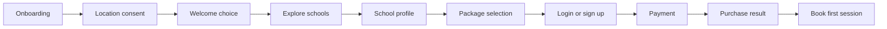

# Core journeys

## New learner

## Returning learner books a lesson

1. Open Sessions.
2. Select one owned package.
3. Tap **Book**.
4. Select an available date and time.
5. Select or accept an instructor assignment.
6. Review school, package, location, instructor, and credit change.
7. Confirm.

The package must not be selected a second time inside the booking wizard.

## Manage a booking

`Sessions → booking history/detail → reschedule or cancel`

Credit behavior after cancellation is still a business-rule question.

## Recover account access

`Login → forgot password → receive OTP → reset password → return to login`

Password recovery uses an OTP, not a reset link.

## Future cross-role session journey

`learner booking → school assignment → instructor conducts lesson → guardian
tracks → instructor submits report → learner progress updates`

Related: [[03 Features/Authentication and Entry]],
[[03 Features/Session Booking]], [[01 Product/Domain Model]]
