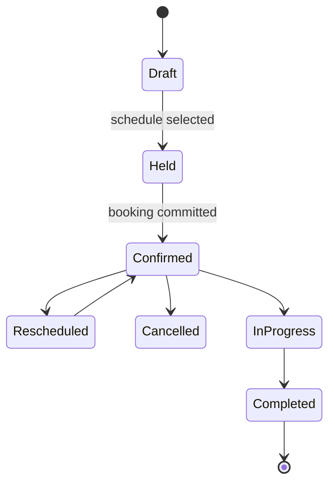

# Domain model

## Core entities

| Entity             | Meaning                                   | Important relationships                                                        |
| ------------------ | ----------------------------------------- | ------------------------------------------------------------------------------ |
| User               | Authenticated identity                    | Has one role; may own learner/guardian/instructor profile                      |
| Driving school     | FRSC-trusted training provider            | Owns instructors, vehicles, locations, and package definitions                 |
| Package definition | School's purchasable training offer       | Defines price, number of sessions, duration, and training category             |
| Package purchase   | A learner's owned instance of a package   | Owns a package-specific remaining-credit balance                               |
| Session credit     | Right to book one lesson under a purchase | Must never lose its package/purchase attribution                               |
| Booking            | Reservation for a lesson                  | Uses one credit and references schedule, school, package, location, instructor |
| Training session   | The performed lesson                      | Evolves from a booking and produces attendance, route, duration, and report    |
| Progress record    | Learning result                           | References a completed session and assessment/report                           |
| Guardian link      | Permission to view a learner              | Controls guardian visibility into sessions and progress                        |

## Package and credit rule

A learner may own several package purchases concurrently.

Example:

| Owned package               | Remaining sessions |
| --------------------------- | -----------------: |
| Defensive Driving           |                 10 |
| Professional Driving        |                 10 |
| **Total dashboard balance** |             **20** |

The number `20` is a useful summary, not a fungible wallet. Booking must debit
the selected package purchase because availability, curriculum, school,
location, and instructor eligibility may differ.

## Booking lifecycle

The exact credit reservation/refund policy is not yet defined. Track it in
[[04 Delivery/Open Questions and Risks]].

## Current TypeScript coverage

Current types cover school catalogue summaries, package definitions, a
presentation-level `LearnerBooking`, guardian links, training-session
lifecycle, and learner-controlled live-location sharing. They do **not** yet
model package purchases, credit ledgers, availability slots, payment intents,
or production session reports.

Code references:

- `../src/types/school.ts`
- `../src/types/booking.ts`
- `../src/types/auth.ts`
- `../src/types/guardian.ts`
- `../src/types/training-session.ts`

Related: [[03 Features/Checkout]], [[03 Features/Session Booking]],
[[02 Architecture/State and Data]]
