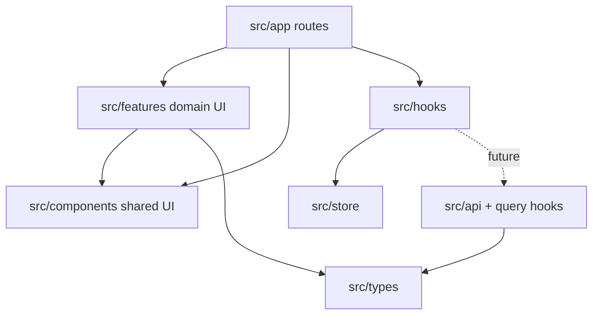

# Architecture overview

> [!principle]
> Avoid overengineering at all costs. See
> [[02 Architecture/Engineering Principles]].

## Current stack

| Concern      | Current choice                                |
| ------------ | --------------------------------------------- |
| Framework    | Expo SDK 56, React Native 0.85, React 19      |
| Language     | TypeScript 6                                  |
| Routing      | Expo Router 56 with typed routes              |
| Styling      | NativeWind 4 and theme tokens                 |
| Client state | Zustand 5                                     |
| Location     | `expo-location`                               |
| Fonts        | Figtree, Inter, Space Grotesk loaded globally |
| Icons        | MaterialCommunityIcons                        |

## Layer rule

- Route files own navigation entry and screen composition.
- Shared visual primitives live in `src/components`.
- Domain-oriented reusable UI and data live in `src/features`.
- Cross-cutting hooks own reusable behavior.
- Zustand is reserved for client state.
- Planned server state belongs in TanStack Query, not Zustand.

## Current bootstrap

`../src/app/_layout.tsx`:

1. Loads global styles and NativeWind setup.
2. Prevents splash hiding until fonts resolve.
3. Resolves light/dark theme.
4. Sets system background color.
5. Provides safe-area context.
6. Mounts the root Expo Router stack.

## Public/protected boundary

- `(public)` contains location, welcome, and school discovery.
- `(auth)` contains identity and recovery.
- `(app)` redirects unauthenticated users to login and preserves `returnTo`.
- `(app)/checkout` is protected and outside learner tabs.
- `(app)/student` contains the current learner tab experience.

## Planned but not present

The project documents describe TanStack Query, secure token storage, API
clients, realtime sockets, notifications, maps, and role-specific route trees.
Those should be treated as planned architecture until their modules and
dependencies exist.

Related: [[02 Architecture/Navigation and Route Map]],
[[02 Architecture/State and Data]], [[04 Delivery/Current State]]
