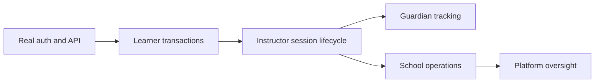

# Roadmap

## Phase A — Make the learner slice real

- [x] Move presentation fixtures into a dedicated `sample_data` boundary.
- [ ] Define backend/mobile API contracts.
- [ ] Add HTTP client, TanStack Query, query keys, and provider.
- [ ] Implement secure authentication hydration and refresh.
- [ ] Replace public school fixtures with catalogue queries.
- [ ] Integrate checkout with backend-created payment intents.
- [ ] Model package purchases and package-specific session balances.
- [ ] Integrate availability, booking creation, history, reschedule, and cancel.
- [ ] Connect profile and progress.
- [ ] Add loading, empty, error, offline, and retry states.

## Phase B — Complete session operations

- [x] Build instructor route tree first.
- [x] Add assigned schedule and availability UI.
- [x] Implement start/end session UI.
- [x] Move instructor start/end lifecycle into shared client session state.
- [ ] Emit active-session state for learner and guardian experiences.
- [x] Add attendance and instructor report UI.
- [x] Add instructor profile, preferences, and support UI.
- [x] Review instructor empty states, consistency, and accessibility.
- [ ] Derive learner progress from completed sessions.

## Phase C — Guardian

- [x] Guardian route tree and linked-learner overview UI.
- [ ] Learner-linking permissions.
- [x] Active-session dashboard and tracking route.
- [x] Learner per-session consent and foreground location publisher.
- [x] Guardian local live map, stale, stopped, and unavailable states.
- [ ] Replace local sharing with authorized realtime transport and reconnect.
- [ ] Session history and progress.
- [ ] Start/end notifications.

## Phase D — School operations

- [ ] School dashboard.
- [ ] Instructor and vehicle management.
- [ ] Package management.
- [ ] Booking assignment and operations.
- [ ] Active-session monitoring.
- [ ] School profile/verification maintenance.

## Phase E — Platform operations and hardening

- [ ] School approvals and trust/safety workflows.
- [ ] Incident handling.
- [ ] Analytics and observability.
- [ ] Accessibility and performance audit.
- [ ] Production release automation.

## Dependency logic

Related: [[04 Delivery/Current State]],
[[03 Features/Future Role Dashboards]]
